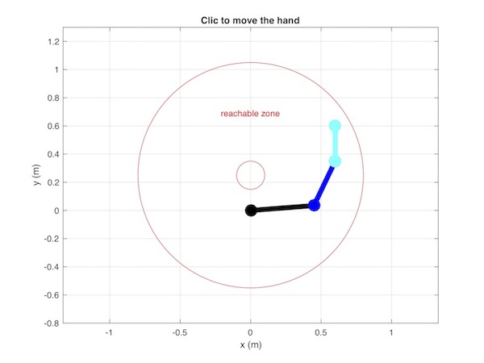
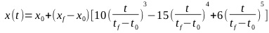
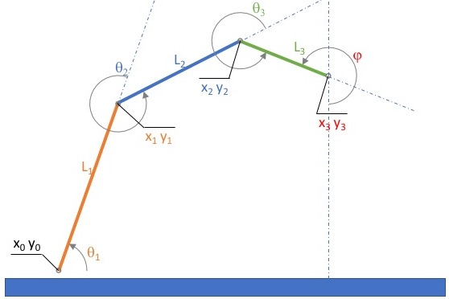

# MinJerk 2D-3Links
Planar movement of 3-segment arm moving smoothly from initial to final position.  

* End-effector motion minimizes the sum of the squared jerk along its trajectory. 
* Link3 has a fixed orientation (phi). 
* Link1 and Link 2 orientation are computed so that the end effector reaches the requested
  2D position.

## Usage
* (Clone or) download the repository 
* On your computer : 
	* Open and run `main.m` with matlab 
	* In the figure, clic (in the reachable zone) to move the hand to a novel position.  

## Code description 
* `main` is the entry point
* `UpdateMinJerk` takes care of the animation of the arm following a clic

### Minimum jerk movement 
* `MinJerkTrajectory` simulates a linear movement that follows a min jerk in 2D
* `MinJerkPositionTimeSeries` produces a min jerk motion in 1D. The output timeseries is sampled at 100hz, and is generated using the following equation:  
  
Where :  
	* Time *t* is in seconds 
	* Position *x* depends on what is measured (meter, pixel, radian, etc).  
	* Initial conditions are (*t0*, *x0*) and final conditions are (*tf*, *xf*).  

* See also: [Mika's coding blog](https://mika-s.github.io/python/control-theory/trajectory-generation/2017/12/06/trajectory-generation-with-a-minimum-jerk-trajectory.html)
and [Shadmehr's paper](http://courses.shadmehrlab.org/Shortcourse/minimumjerk.pdf) and for more [Philip Freeman's PhD](https://openscholarship.wustl.edu/etd/689/)  

## Basic geometry in 2D 
The goal is to produce a minimum-jerk trajectory of the end effector of an N-Links arm, 
with a simple geometrical approach, which is easy for a non-redundant system. 

### For a 2-links arm
With 2 links in a 2D space, the system is not redundant: a unique solution exists. 
* `Cart2Ang` computes the angles of a 2 links segment in 2D
* `Ang2Cart` computes the coordinates of a 2 links segment in 2D
 
### For a 3-links arm
With one more link, the system is redundant: no unique solution exists... 
Yet, if the orientation of one link is invariant, the problem is back to a 2 degrees of 
freedom problem.
* Link3 orientation = constant => constant position shift from Link2 to Link3
* Link2 and Link1 are free => back to a 2-links arm 

The graphical representation of the arm shows the definitions of angles and coordinates.  
    

